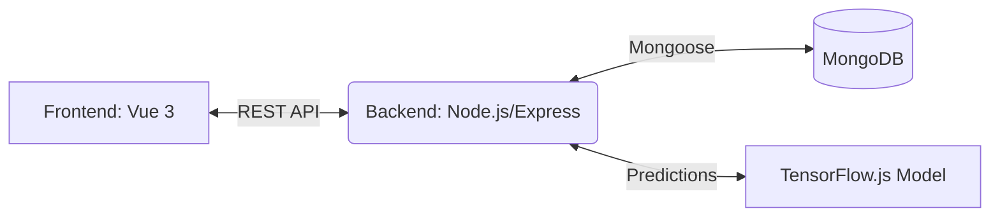

# 🔬 Dermalens — AI-Powered Skin Disease Analysis


> A full-stack application designed for skin disease analysis, combining a modern web interface with machine learning capabilities.

## ✨ Features
- 🛡️ **User Authentication:** Secure JWT-based registration and login system.
- 🖼️ **Image Analysis:** Upload skin images and receive AI-powered diagnostic predictions.
- 📅 **Appointment Scheduling:** Connect with specialists and book consultations seamlessly.
- 📧 **Email Notifications:** Automated alerts and confirmations.
- 📱 **Responsive Design:** Optimized for both desktop and mobile platforms.

## 🏗️ Architecture


## 🛠️ Tech Stack
| Component | Technology |
|---|---|
| **Frontend** | Vue 3 (Composition API), Vite, Tailwind CSS, PrimeVue |
| **Backend** | Node.js, Express, JWT |
| **Database** | MongoDB, Mongoose |
| **Machine Learning**| TensorFlow.js, Keras (Pre-trained) |

## 🚀 Getting Started

### Prerequisites
- Node.js (v16+ recommended)
- MongoDB instance (local or Atlas)

### Clone & Install
```bash
git clone https://github.com/your-username/dermalens.git
cd dermalens

# Install frontend dependencies
npm install

# Install backend dependencies
cd backend
npm install
```

### Environment Setup
1. Create a `config.env` in the `backend/` directory (see `backend/config.env.example` for reference).
2. Create a `.env` in the root directory (see `.env.example` for reference).

### Run Dev Servers

#### Backend (runs on port 5000)
```bash
cd backend
npm run dev
```

#### Frontend (runs on port 3000)
```bash
# In the project root directory
npm run dev
```

## 📡 API Reference

| Endpoint | Method | Auth Required | Description |
|---|---|---|---|
| `/api/auth/register` | POST | No | Register a new user |
| `/api/auth/login` | POST | No | Authenticate user & get token |
| `/api/analysis/predict` | POST | Yes | Upload image & get prediction |
| `/api/appointments/book` | POST | Yes | Book a consultation |
| `/api/appointments/` | GET | Yes | Retrieve user's appointments |

## 📁 Project Structure

```
dermalens/
├── backend/               # Express server and business logic
│   ├── config/            # Server configuration
│   ├── controllers/       # Route handlers
│   ├── models/            # Mongoose schemas
│   ├── routes/            # API endpoints
│   └── uploads/           # Image storage
├── Dermalens-model/       # TF.js machine learning assets
├── src/                   # Vue 3 frontend source code
│   ├── components/        # Reusable UI elements
│   ├── views/             # Page components
│   ├── store/             # Vuex state
│   └── router/            # Vue router setup
└── public/                # Static assets
```

## 🤝 Contributing
Contributions, issues, and feature requests are welcome!

## 📄 License
This project is licensed under the MIT License - see the LICENSE file for details.
